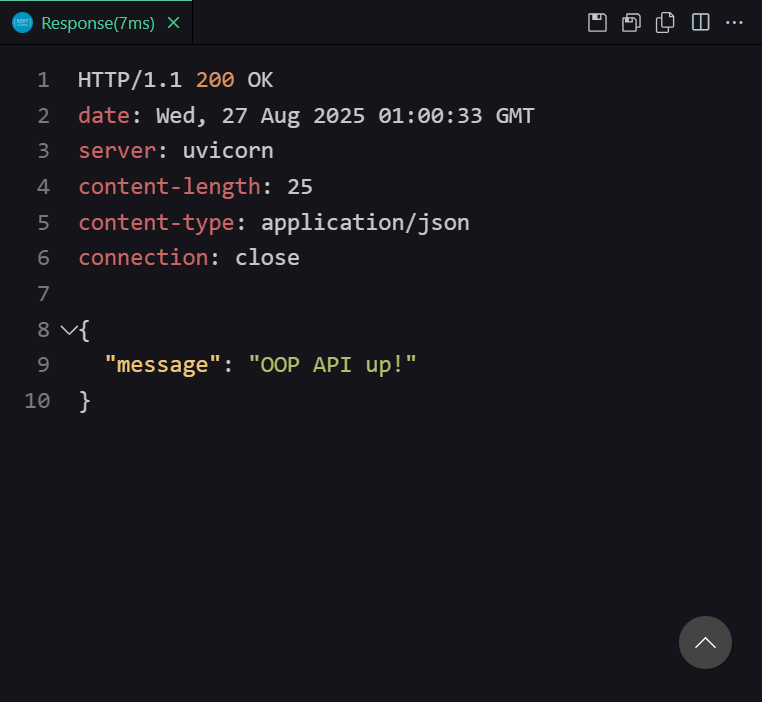

# Evidências – API OOP (Python)

## 1. Execução do servidor

- Terminal com `uvicorn app.main:app --reload` e log "Uvicorn running on <http://127.0.0.1:8000>".

- Print do Swagger UI (`/docs`).

- Print do ReDoc (`/redoc`)

## 2. Consumo via VS Code – REST Client

- **Healthcheck**: resposta JSON de `/`.

- **Criar Wizard** (201).
  

- **Criar Ninja** (201).

- **Listar** `/characters`

- **Obter por ID** `/characters/{id}`: resposta do item 1.

- **Polimorfismo** `/characters/1/speak` e `/characters/2/speak`.

- **Remover** `/characters/2`.

## 3. Observações técnicas

- Como a fábrica no `POST /characters` decide qual classe instanciar com base em `type`.
- Encapsulamento com propriedades (`name`).
