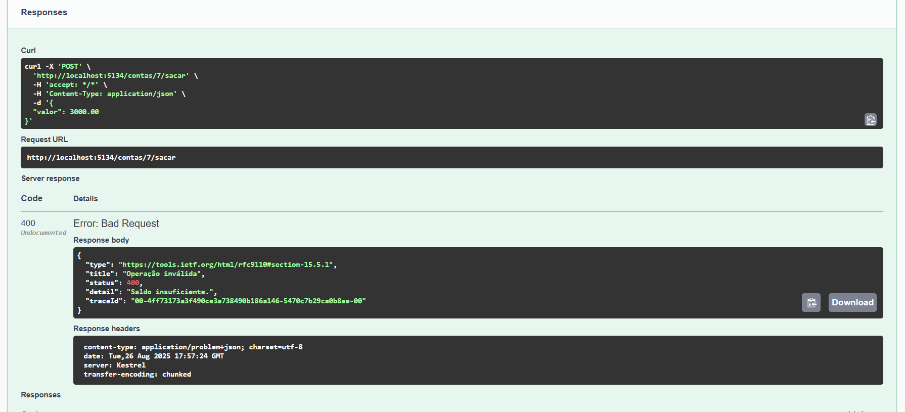

# Evidências — Atividade 6 (Encapsulamento)

## Ambiente

- SO: Windows 11
- .NET SDK: 9.0
- Editor: VS Code

## Execução

- ``dotnet run`` → URL: <http://localhost:5134>

## Swagger

- swagger/index

- GET /contas

- POST /contas — 201 — [PRINT]

- GET /contas/{id} — 200

- GET /contas/{id} — 404

- POST /contas/{id}/depositar — 200

- POST /contas/{id}/sacar — 200 — [PRINT]

- POST /contas/{id}/sacar — 400 — **Operação inválida: Saldo insuficiente.**

## VS Code REST Client

- Arquivo `APIEncap.http`
- Execução dos requests (criar, listar, buscar, depositar, sacar, erro)

## Conclusão

- Encapsulamento evidenciado por: campos privados, propriedades read-only, métodos controladores de estado e exposição via DTO/View.
